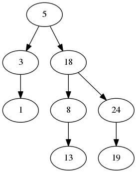

# VisualBST
===========
VisualBST constructs a Binary Search Tree while displaying the tree
(graphically with <a href = "http://www.graphviz.org/"> Graphviz </a>) as you create it.
It saves the graph as a .png.

Here is an example:

